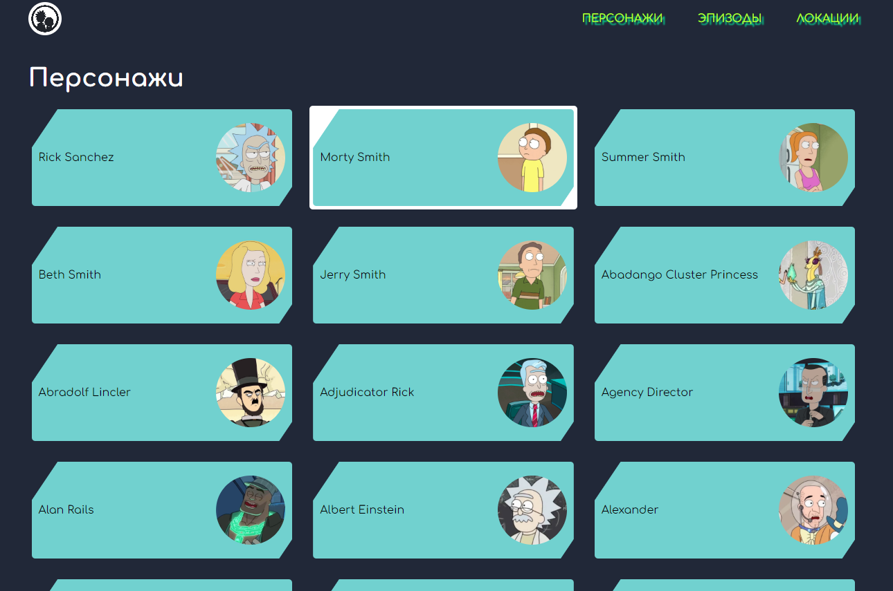

# 🧪 Rick and Morty Explorer (Vue 3)
Приложение на Vue 3, использующее открытое API Rick and Morty.
Проект по одноименному мультсериалу "Рик и Морти".
Позволяет просматривать персонажей, эпизоды и локации — с фильтрацией, пагинацией и детальными страницами.

Здесь вы ознакомитесь с персонажами. Узнаете из каких они вселенных, какой расы, какого гендера, в какой локации они встречались и даже живы ли они.
Так же вы можете посмотреть список серий разделенный по сезонам что очень удобно. 

## Про код и архитектуру которой придерживался
https://github.com/user-attachments/assets/5795dcce-c3bb-4eca-bbf7-94e6ee935247
## Про вид в браузере
https://github.com/user-attachments/assets/c7129f9d-566b-4458-a256-f2c5a5663e71

---

## 🚀 Технологии

---

## 🧰 Команды

| Команда | Назначение |
|----------|------------|
| `npm run serve` | Запуск проекта в режиме разработки |
| `npm run build` | Сборка проекта |
| `npm run lint` | Проверка кода линтером |

---

## 🌈 Возможности
- 🔍 Главная страница — краткое описание приложения и ссылки на разделы
- 👽 Персонажи
Список персонажей с пагинацией
Поиск и фильтрация по статусу и виду
Детальная страница с описанием персонажа
- 📺 Эпизоды
Таблица с эпизодами
Переход на страницу эпизода, где отображаются участвующие персонажи
- 🌍 Локации
Список всех локаций
Детальная страница с обитателями
- ⚙️ Axios для запросов к API
- Расширяемая архитектура для добавления новых модулей

---

## 📦 API
Данные берутся из открытого [Rick and Morty API](https://rickandmortyapi.com/).
Например: axios.get("https://rickandmortyapi.com/api/character");
---

## 🧩 Превью интерфейса

---

## ✨ Автор

**Лугинов Дьулустаан**  
Frontend Developer | React / TypeScript / Node.js  
📫 Telegram: [@JulustaanL](https://t.me/JulustaanL)

